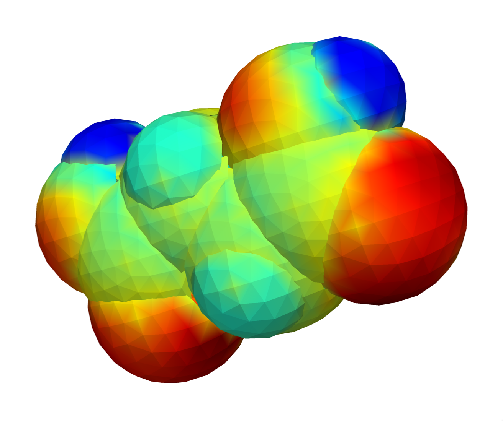
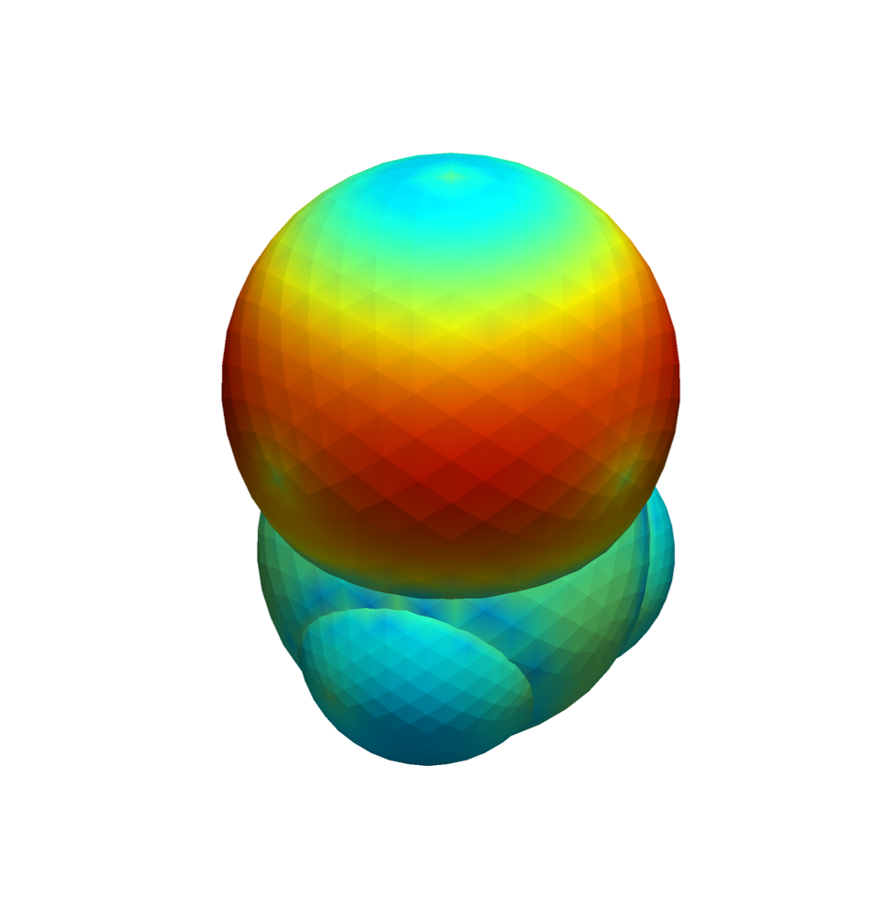
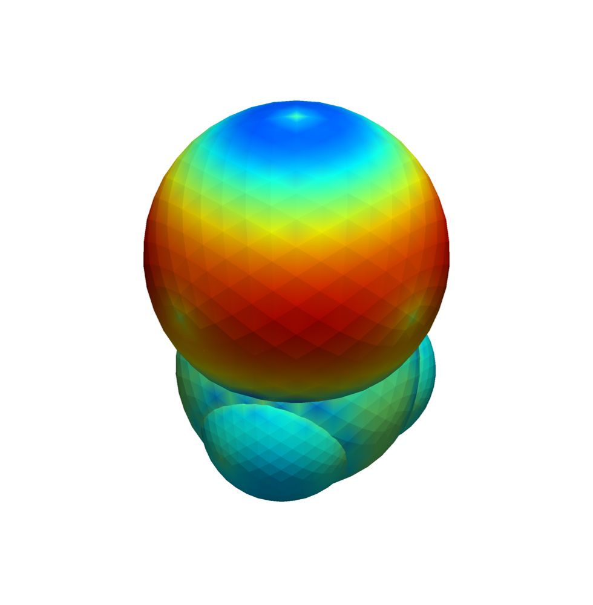

<table>
<tr>
<td style="vertical-align: middle;">

# COSMO Surface Viewer

Build colored surface charge or potential surfaces from ORCA's `.cpcm` files and view or render them.

Features
- Parses `.cpcm` to points, potentials, areas, and sphere owners
- Builds faces with neighbor filtering and ownership constraints
- Maps potentials to colors using a configurable Matplotlib colormap
- Writes VRML (`.wrl`) and renders to `.png` with off‑screen or on‑screen modes

</td>
<td style="vertical-align: middle; padding-left: 20px;">
  
  
Surface charges of succinic acid in water

</td>
</tr>
</table>

### Quick Start
- Python 3.9+
- Create a virtual environment and install requirements:

  - `python -m venv .venv && source .venv/bin/activate`
  - `pip install -r requirements.txt`

- Place your `.cpcm` files in `./input/` (or point to a different folder).
- Generate `.wrl` and `.png` with defaults:

  - `python cosmo_render.py`

### CLI Usage
- Show all options: `python cosmo_render.py --help`

Common flags
- `--input`: input directory with `.cpcm` files (default: `input`)
- `--output`: directory for `.wrl` and `.png` files (default: `output`)
- `--force`: rebuild and re‑render even if outputs exist
- `--onscreen`: use on‑screen rendering (off‑screen by default)
- `-v` / `-vv`: increase verbosity

### Examples
- Small halides in water: You can see the change in the sigma hole in those images.

<table>
<tr>
<td align="center">

 
<em>CH3Br in water.</em>
</td>
<td align="center">

 
<em>CH3I in water.</em>
</td>
</tr>
</table>

- Aspartic acid surface charges during SCF iterations:

### Using VRML with other software
- The generated `.wrl` files can be opened in, e.g., UCSF Chimera for interactive viewing alongside molecular structures (e.g., an `.xyz` or PDB file). Chimera project: https://www.cgl.ucsf.edu/chimera/

### Packaging (optional)
- A minimal `pyproject.toml` is included. Install editable and use the console script:

  - `pip install -e .`
  - Run: `cosmo-render --help`

### Notes
- Off‑screen rendering requires a working VTK/PyVista setup; depending on your platform
  you may need system OpenGL or OSMesa. If off‑screen fails, try `--onscreen`.
- Output directories are created automatically.
